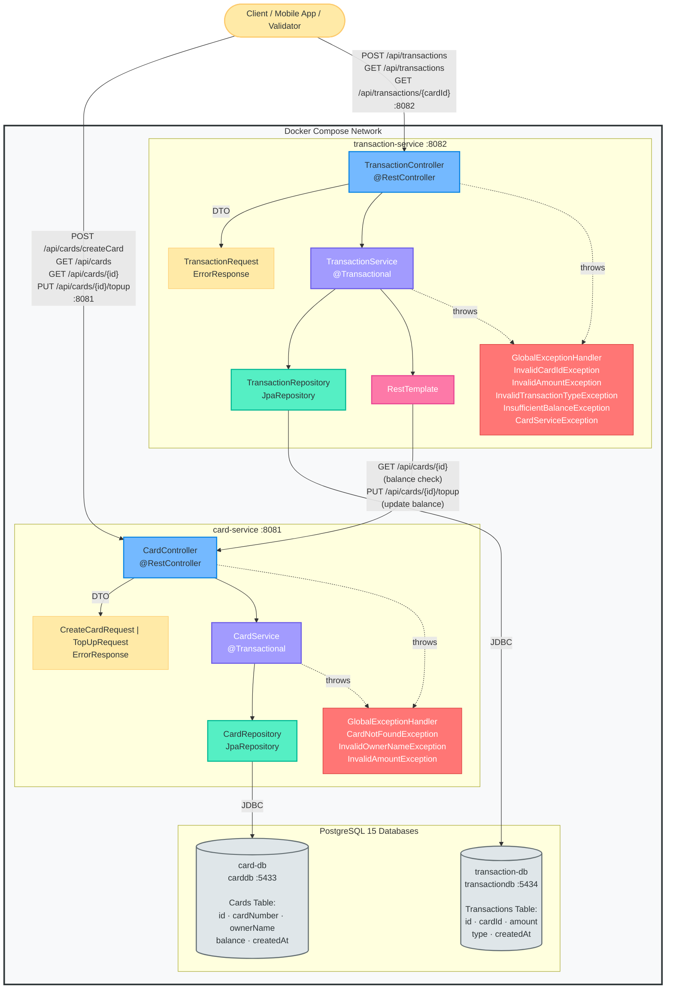
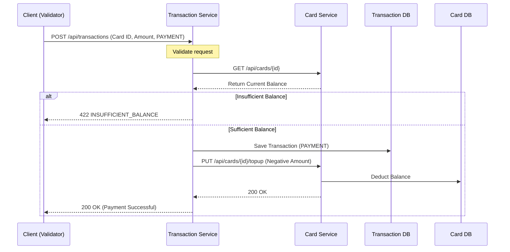
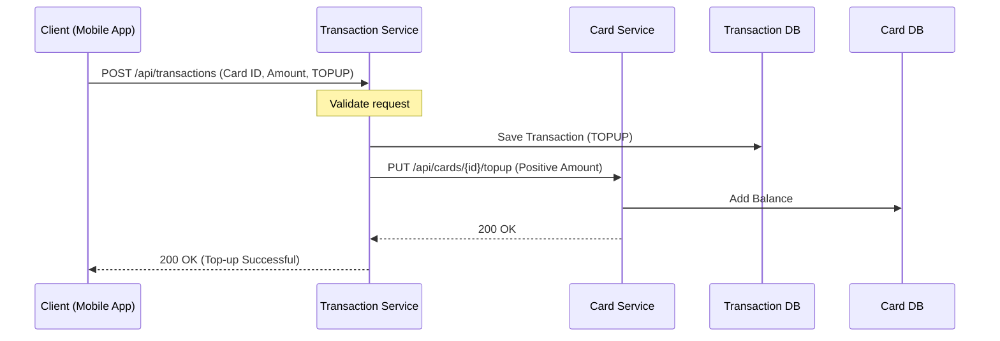

# Transit Card API

A microservices-based REST API built with Spring Boot for managing transit cards and recording financial transactions (top-ups and payments). Fully containerized with Docker Compose.

---

## Architecture Overview

- **Microservices:** Two independent Spring Boot services (`card-service` and `transaction-service`).
- **Database-per-Service:** Each service has its own PostgreSQL database (`carddb`, `transactiondb`).
- **Inter-service Communication:** `transaction-service` communicates synchronously via `RestTemplate` with `card-service` to verify and update card balances.
- **Layered Design:** Controller -> Service -> Repository pattern using DTOs for data transfer.
- **Error Handling:** Centralized `@RestControllerAdvice` provides consistent error responses.
- **API Documentation:** Interactive API documentation provided via `Swagger` for easy testing and exploration.
- **Dockerized:** All components run seamlessly in a shared Docker Compose network.

### High-Level Architecture



---

## API Endpoints

### Card Service (`:8081`)

| Method | Endpoint | Description |
|---|---|---|
| `POST` | `/api/cards` | Create a new card |
| `GET` | `/api/cards` | List all cards |
| `GET` | `/api/cards/{id}` | Get card by ID |
| `PUT` | `/api/cards/{id}/topup` | Top up card balance |

### Transaction Service (`:8082`)

| Method | Endpoint | Description |
|---|---|---|
| `POST` | `/api/transactions` | Record a transaction (TOPUP or PAYMENT) |
| `GET` | `/api/transactions` | List all transactions |
| `GET` | `/api/transactions/{cardId}` | Get transactions by card ID |

---

## API Documentation (Swagger UI)

Both services include interactive Swagger UI for easy exploration and testing of the endpoints. 

Once the application is running via Docker Compose, you can access the Swagger documentation using the following links:

* **Card Service API Docs:** [http://localhost:8081/swagger-ui/index.html](http://localhost:8081/swagger-ui/index.html)
* **Transaction Service API Docs:** [http://localhost:8082/swagger-ui/index.html](http://localhost:8082/swagger-ui/index.html)

---

## Example Flows

### 1. Payment Flow



### 2. Top-Up Flow



---

## Tech Stack & Data Models

**Core Stack:** Java 24, Spring Boot 3.4.1, PostgreSQL 15, Docker Compose, Maven.

| Service | Entity | Key Fields |
|---|---|---|
| `card-service` | **Card** | `id`, `cardNumber` (UUID), `ownerName`, `balance`, `createdAt` |
| `transaction-service` | **Transaction** | `id`, `cardId`, `amount`, `type` (TOPUP/PAYMENT), `createdAt` |

---

## How to Run & Usage

**Prerequisites:** Docker, Java 24, Maven

```bash
# 1. Build Services
cd card-service
mvn clean package -DskipTests
cd ..

cd transaction-service
mvn clean package -DskipTests
cd ..

# 2. Start Application
docker-compose up --build

# 3. Stop & Clean DBs
docker-compose down -v
```